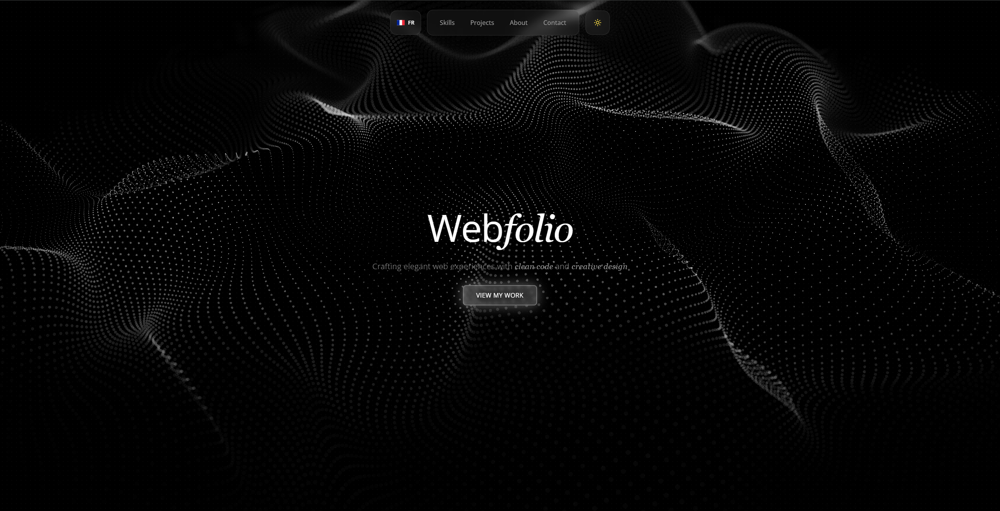

# Jay-Folio

Portfolio web de Léo-Paul Jay

---

## Présentation

Jay-Folio est un portfolio moderne développé avec React, Vite et Tailwind CSS. Il présente mes projets, compétences et informations de contact, avec une navigation fluide et un design responsive.

- **Framework** : React 19 + Vite
- **Style** : Tailwind CSS
- **Langues** : Français / Anglais
- **Contact** : Formulaire (Formspree)

## Fonctionnalités

- Scroll horizontal sur desktop, vertical sur mobile
- Thème clair/sombre automatique
- Section projets dynamique (liens, images, showLiveDemo)
- Footer sticky avec mentions légales
- Page Mentions légales (FR/EN)
- Téléchargement du CV

## Aperçu



## Installation

```bash
npm i
npm run dev
```

## Personnalisation

- Ajoutez vos projets dans :
  `src/components/ui/projects-section.tsx`
- Modifiez les textes dans :
  `src/context/LanguageContext.tsx`
- Ajoutez votre CV dans :
  `public/cv.pdf`

> N’hésitez pas à me contacter pour toute question ou collaboration !
